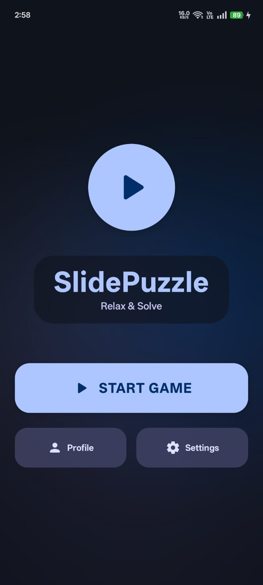
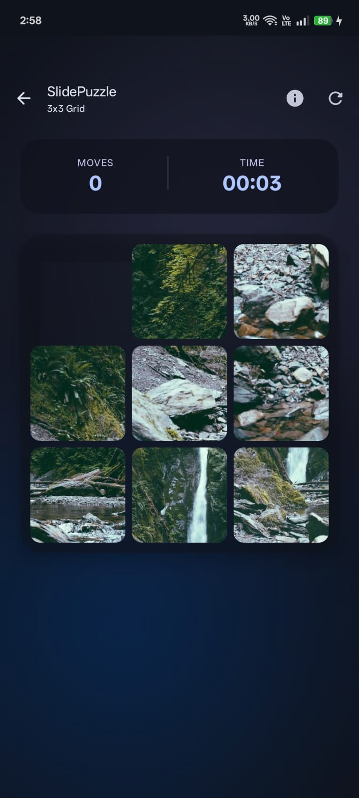
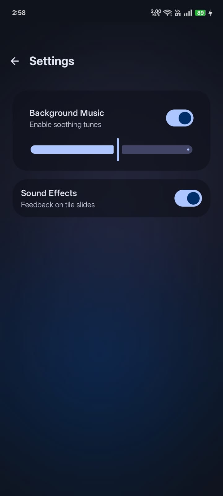

# SlidePuzzle


A modern Android slide puzzle game built with **Kotlin** and **Jetpack Compose**, featuring customizable grid sizes, custom image puzzles, smooth animations, immersive audio, and a polished Material 3 design.

---

## Preview

> Game screenshots and preview

<p align="center">
  
  
  
</p>

#### Gameplay Demo

<p align="center">
  
</p>

---

## Features

* Dynamic puzzle sizes from **3x3 up to 10x10**
* Smooth animated tile movement
* Predefined puzzle images
* User-uploaded images from gallery or camera
* Random puzzle mode
* Real-time timer
* Move counter
* Mini preview of solved image
* Context-aware background music
* Sound effects for tile movement and victory
* Player profile support
* Persistent local high score tracking
* Audio settings controls
* Cozy Material 3 UI with animated background

---

## Tech Stack

* **Language:** Kotlin
* **UI Framework:** Jetpack Compose (Material 3)
* **Architecture:** MVVM
* **Database:** Room Database
* **Image Loading:** Coil
* **Audio:** Media3
* **Concurrency:** Kotlin Coroutines + Flow
* **Code Processing:** KSP

---

## Project Architecture

The application is structured into the following major parts:

* **Puzzle Engine**
  Handles grid generation, tile movement rules, solvable shuffling, and win-state detection.

* **UI Layer**
  Built using Jetpack Compose with Material 3 styling and edge-to-edge support.

* **Navigation Layer**
  Manages transitions between Home, Game, Profile, and Settings screens.

* **Persistence Layer**
  Uses Room Database to store player data, preferences, and high scores.

* **Audio Manager**
  Controls background music and sound effects across screens.

* **Image Pipeline**
  Supports predefined images and custom user-supplied images from gallery/camera.

---

## Gameplay Features

### Dynamic Grid Engine

Supports multiple puzzle sizes:

* 3x3
* 4x4
* 5x5
* Custom sizes up to 10x10

### Personalized Puzzle Experience

Players can:

* Choose built-in puzzle images
* Upload their own images
* Capture photos using the camera
* Play with random image and grid combinations

### Immersive UI Design

* Material 3 design
* Edge-to-edge display
* Smooth tile animations
* Animated blurred beams background
* Mini preview image of solved state

### Audio Experience

* Separate music for Home and Game screens
* Tile move sound effects
* Victory sound feedback
* Audio toggles in Settings

---

## Development Details

### Foundation Logic

* Initialized Room database for player profiles and high scores
* Built the puzzle engine for dynamic grid generation
* Implemented solvable shuffling logic
* Added tile movement validation
* Created image tile-splitting logic

### Navigation and Settings

* Integrated Jetpack Compose Navigation
* Built Home screen
* Built Player Profile screen
* Built Settings screen
* Added persistent controls for BGM and SFX

### Game Experience

* Developed the main Game screen
* Connected puzzle engine with reactive UI updates
* Added timer system
* Added move counter
* Implemented win-state detection and feedback

### Image Integration

* Added predefined image selection
* Enabled gallery image upload
* Added camera image support
* Implemented Random Mode

### UI Polish

* Added adaptive app icon
* Refined Material 3 theme
* Improved visual consistency
* Added smooth transitions and cozy layout refinement

### Alive UI Refinements

* Added animated blurred beams background
* Added mini preview image of solved state
* Enhanced overall app feel with more immersive visuals

### Final Audio Integration

* Added Home screen background music
* Added Game screen background music
* Added tile move sound effects
* Added victory sound effects

### Verification

* Successful clean build completed
* Unit tests passed
* Puzzle engine behavior validated
* App verified to be stable and crash-free

---

## Download APK

[Download SlidePuzzle APK](apk/SlidePuzzle-v1.0.1.apk)

---

## How to Run

1. Clone the repository

```bash
git clone https://github.com/KaranVishwakarma-1807/SlidePuzzle.git
```

2. Open the project in **Android Studio**
3. Sync Gradle
4. Run on an emulator or physical Android device

---

## Repository Structure

```bash
SlidePuzzle/
├── app/
│   ├── src/
│   │   ├── main/
│   │   │   ├── java/
│   │   │   ├── res/
│   │   │   └── AndroidManifest.xml
│   ├── build.gradle.kts
├── gradle/
├── build.gradle.kts
├── settings.gradle.kts
└── README.md
```

---

## Future Improvements

* Online leaderboard
* Cloud save support
* Difficulty presets
* Multiplayer challenge mode
* Achievement system
* Daily puzzle mode

---

## Author

**Karan Vishwakarma**

GitHub: [KaranVishwakarma-1807](https://github.com/KaranVishwakarma-1807)

---

## License

This project is open for learning, personal development, and portfolio purposes.
